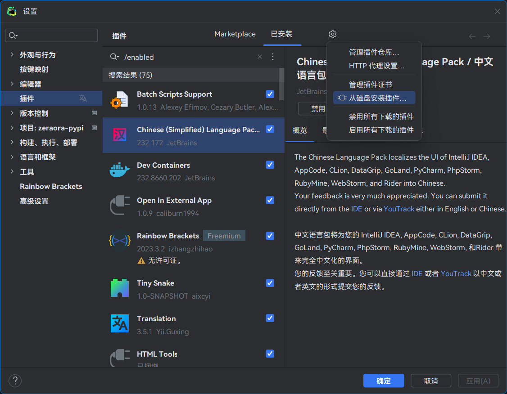

# Tiny Snake

中文版 | [English](./README_EN.md)

一个 PyCharm 小插件，用于提升自己的 Python 开发体验。

| 功能                            | 键位                 | 菜单                           |
|-------------------------------|--------------------|------------------------------|
| [重构 dict](#重构-dict)           | `Ctrl` `Alt` `D`   | (右键) -> 重构 -> dict 转换        |
| [优化 \_\_all\_\_](#优化-__all__) | `Ctrl` `Shift` `D` | 代码 -> 优化 \_\_all\_\_         |
| [生成 \_\_all\_\_](#生成-__all__) | -                  | (右键) -> 生成... -> \_\_all\_\_ |
| [在文档字符串中插入超链接](#在文档字符串中插入超链接) | `Alt` `L`          | (右键) -> 生成... -> 超链接         |
| [生成 Shebang 行](#生成-shebang-行) | -                  | (右键) -> 生成... -> Shebang 行   |

## 安装

1. 点击[这里](https://github.com/aixcyi/TinySnake/releases)下载 jar 文件；
2. 点击 PyCharm 插件管理的右上方管理菜单，选择 **从磁盘安装插件...** 。



## 更新

在插件管理页中卸载 Tiny Snake 并点击 **确定** 按钮关闭页面，然后再打开插件管理页，重新 [安装](#安装) 即可在不重启 PyCharm 的情况下更新 Tiny Snake。

## 功能

### 生成 \_\_all\_\_

按照符号声明顺序列出所有一般来说可以导出的符号，包括

1. 顶层作用域中所有不以下划线开头的变量、函数和类；
2. 顶层作用域中 `if` 语句体内的所有不以下划线开头的变量、函数和类。

以下符号不会被收录

- 特殊变量，例如 `__author__`
- 私有符号，例如 `_var` 、 `_func()` 、 `_InnerClass`
- 在 `for` 循环中解包的变量，例如 `for i in range(10)` 中的 `i`
- 导入的符号

灰色的是已经在 `__all__` 中的符号，可以重复选择，但不会重复添加，也不会影响添加顺序。


### 优化 \_\_all\_\_

提供了对 `__all__` 变量值的优化，包括排序、换行方式以及字符串风格。

会记住优化选项，并影响下一次 [生成 \_\_all\_\_](#生成-__all__) 的结果。


### 在文档字符串中插入超链接

在文档字符串（docstring）中插入超链接。

插入的超链接只在 reStructuredText 格式中有效。
如果在 PyCharm 中不能正确显示，可以在 "设置 -> 工具 -> Python 集成工具 -> Docstring" 中更改渲染格式。
VS Code 及其它 IDE 暂未测试过。


当鼠标移动到带有文档字符串的符号或文件上时，展示效果如下：


### 生成 Shebang 行

> Shebang 是以 `#!` 开头的单行备注，只能放在文件第一行，用于标明当前文件需要哪个解释器来解释/执行。

> Windows 下使用 py.exe 运行脚本即可解析 Shebang 。

预置了几种常见于 Python 脚本的 Shebang，还可以选择基于项目的路径、绝对路径以及自定义文本（方便粘贴）等。

写 Python 脚本的同时还记不住 Shebang 的时候挺重要的，其它情况下聊胜于无。

没有考虑自定义预置项目，毕竟这插件就是面向 PyCharm 的，加上常用的 Shebang 也就那么几条。


### 重构 dict

互相转换 `dict` 字面值

```python
DATABASE = {
    "ENGINE": 'django.db.backends.postgresql',
    "NAME": '<数据库名称>',
    "USER": 'postgres',
    "PASSWORD": None,
    "HOST": '127.0.0.1',
    "PORT": '5432',
}
```

与 `dict()` 调用

```python
DATABASE = dict(
    ENGINE='django.db.backends.postgresql',
    NAME='<数据库名称>',
    USER='postgres',
    PASSWORD='',
    HOST='127.0.0.1',
    PORT='5432',
)
```

## 反馈

- 请对 bug 重拳出击，我会积极解决。
- 新需求可能没那么快处理，也可能不能处理，因为俺的 Java 是现学现用的。
