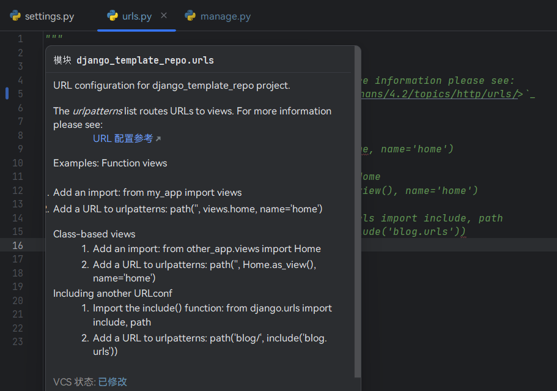
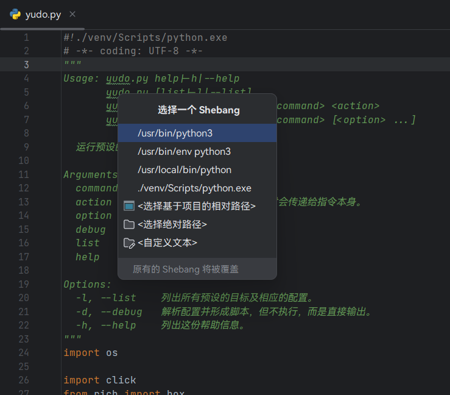

# Tiny Snake

 

一个用于提升 Python 开发体验的 PyCharm 小插件。

## 特性

- 生成 `__all__` 变量，对变量值列表进行排序，更换引号风格和换行风格等。
- 在 [reStructuredText](https://en.wikipedia.org/wiki/ReStructuredText) 格式的[文档字符串](https://docs.python.org/zh-cn/3/glossary.html#term-docstring)中插入超链接。
- 插入或覆盖文件头部的 shebang，管理预置的 shebang 列表。
- 支持多种语言。

## 安装

前往插件应用市场搜索“Tiny Snake”：  
菜单 → 文件 → 设置... → 插件 → Marketplace

## 用法

### 生成 `__all__`

列出顶层作用域以及顶层 `if` 体内的可以导出的变量、函数和类，按照符号声明顺序／字母顺序／字符顺序排序生成 `__all__` 列表。以下符号不会被收录：

- 特殊变量，例如 `__author__`
- 私有符号，例如 `_var` 、 `_func()` 、 `_InnerClass`
- 在 `for` 循环中解包的变量，例如 `for i in range(10)` 中的 `i`
- 导入的符号（除非主动包含）

灰色的是已经在 `__all__` 中的符号，可以重复选择，但不会重复添加。

### 优化 `__all__`

对 `__all__` 的列表（也就是变量值）进行排序，更改换行方式、引号风格。同时记住优化选项，影响下一次生成 `__all__` 的结果。

### 在文档字符串中插入超链接

> 文档字符串指的是 [docstring](https://docs.python.org/zh-cn/3/glossary.html#term-docstring) 。

插入的超链接只在 [reStructuredText](https://en.wikipedia.org/wiki/ReStructuredText) 格式的文档字符串中有效。
如果在 PyCharm 中不能正确显示，可以在 "文件 → 设置... → 工具 → Python 集成工具 → Docstring" 中更改渲染格式。

当鼠标移动到带有文档字符串的符号或文件上时，展示效果如下：

### 生成 Shebang 行

> Shebang 是以 `#!` 开头的单行备注，只能放在文件第一行，用于标明当前文件需要哪个解释器来解释/执行。

> Windows 下使用 py.exe 运行脚本即可解析 Shebang 。

预置了几种常见于 Python 脚本的 Shebang，还可以选择基于项目的路径、绝对路径以及自定义文本（方便粘贴）等。

可以打开设置面板（`Control` `Alt` `S`），找到 “工具 → Tiny Snake → Shebang 列表” 配置内容及调整顺序。

## 参与贡献

### 翻译

在 `./src/main/resources/messages/` 中新建一个名为 `TinySnakeBundle_<LNG>.properties` 的文件，或者选择任意一个 `properties` 文件。而 `<LNG>` 表示语言代码，参见 [ISO_639-1](https://zh.wikipedia.org/wiki/ISO_639-1)。

有两种方法快速编辑：

1. 在 IntelliJ IDEA 中打开此项目，安装插件 [Resource Bundle Editor](https://plugins.jetbrains.com/plugin/17035-resource-bundle-editor)，打开新建或现有的文件，然后在底部从「文本」模式切换为「资源包」模式。
2. 将任意一个 `properties` 文件的内容复制过来，然后按照 `key=value` 的格式去掉所有 value，并填入你需要翻译的文本。

### 错误反馈

前往 [issue](https://github.com/aixcyi/TinySnake/issues) 搜索错误信息或反馈错误，或者加入QQ群 418751161 。
