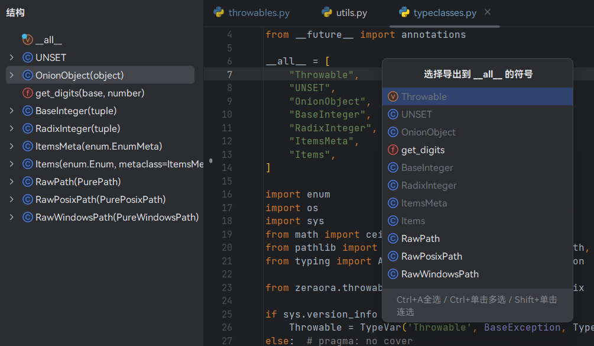
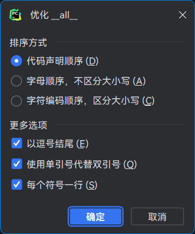

# Tiny Snake

[中文版](./README.md) | English

A tiny PyCharm plugin for me.

| Features                                        | Keyboard           | Menu                                         |
|-------------------------------------------------|--------------------|----------------------------------------------|
| [Convert dict](Convert-dict)                    | `Ctrl` `Alt` `D`   | (Right Click) -> Refactor -> dict conversion |
| [Optimize \_\_all\_\_](#Optimize-__all__)       | `Ctrl` `Shift` `D` | Code -> Optimize \_\_all\_\_                 |
| [Generate \_\_all\_\_](#Generate-__all__)       | -                  | (Right Click) -> Generate... -> \_\_all\_\_  |
| [Generate Shebang Line](#Generate-shebang-Line) | -                  | (Right Click) -> Generate... -> Shebang Line |

## Installation

1. Click [here](https://github.com/aixcyi/TinySnake/releases) and download "jar" file.
2. Goto PyCharm plugin manager, click **Install Plugin from Disk...** from menu on upper-right.


## Features

### Generate \_\_all\_\_

List all exportable symbols in order of symbol declaration, include

1. All variables, functions and classes in the top-level scope that do not begin with an underscore.
2. All variables, functions and classes on `if` statement body in the top-level scope that do not start with an underscore.

The following symbols will not be included

- dunder variables (double under line variables), `__author__` e.g.
- private symbols, such as `_var`, `_func()`, `_InnerClass`.
- variables unpacked in `for` loop, such as the `i` in `for i in range(10)` .
- imported symbols.

Gray item indicate the symbol is in `__all__`, it will not be included even if you choose it.



### Optimize \_\_all\_\_

Resort the list of `__all__`, change string style, and so on.

Optimization options will be remembered and affect the results of the next [生成 \_\_all\_\_](#Generate-__all__).



### Generate Shebang Line

Provide some common Shebang. You can also generate Shebang from a path base on project root, an absolute path, or any string.


### Convert dict

Convert between literal `dict`

```python
DATABASE = {
    "ENGINE": 'django.db.backends.postgresql',
    "NAME": '<DATABASE-NAME>',
    "USER": 'postgres',
    "PASSWORD": None,
    "HOST": '127.0.0.1',
    "PORT": '5432',
}
```

and `dict()`

```python
DATABASE = dict(
    ENGINE='django.db.backends.postgresql',
    NAME='<DATABASE-NAME>',
    USER='postgres',
    PASSWORD='',
    HOST='127.0.0.1',
    PORT='5432',
)
```
