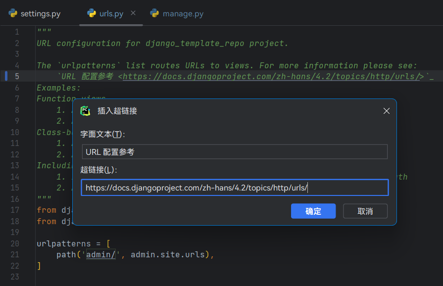

# Tiny Snake

A tiny plugin to improve Python development experience.

## Features

- Generate variable `__all__`, sort it list, change quotes and lines style, etc.
- Insert hyperlink into [reStructuredText](https://en.wikipedia.org/wiki/ReStructuredText) format [docstring](https://docs.python.org/3/glossary.html#term-docstring).
- Insert or overwrite shebang line on file head, and manage preset shebang list.
- Create a Django app via UI window. And you can create a sub-package instead of any file or skip creation of it.
- Supports multiple languages.

## Installation

Menu → File → Settings... → Plugins → Marketplace  
And then search "Tiny Snake".

## Usage

### Generate `__all__`

List all exportable symbols, in order of symbol declaration, by alphabet order, or by character order. The following symbols will not be included

- dunder variables (double under line variables), `__author__` e.g.
- private symbols, such as `_var`, `_func()`, `_InnerClass`.
- variables unpacked on `for` loop, such as the `i` in `for i in range(10)` .
- imported symbols (unless you include them manually).

Gray item indicate the symbol is already in `__all__`, it will not be included even if you choose it.

### Optimize `__all__`

Resort the list of `__all__`, change quotes style, change line style, etc.

Optimization options will be remembered and affect the results of the next [Generate `__all__`](#Generate-__all__).

### Insert hyperlink into docstring

Inserted hyperlink was effect when it rendered by [reStructuredText](https://en.wikipedia.org/wiki/ReStructuredText) format [docstring](https://docs.python.org/3/glossary.html#term-docstring) .

If PyCharm rendering fails, change docstring format on: _File_ → _Settings..._ → _Tools_ → _Python Integrated Tools_ → _Docstrings_

When your mouse hover on symbol or file, or their docstring, PyCharm will pop up a window like:

### Generate Shebang Line

Provide some common Shebang. You can also generate Shebang from a path base on project root, an absolute path, or any string.

To config preset Shebang list and it's order, open settings panel (by `Control` `Alt` `S`) and find _Tools_ → _Tiny Snake_ → _Shebang list_

### Create Django app

Right click any project file on _Project_ → _New_ → _Django App_ to show this menu.

It will auto-translate path of current file path to Django app module, and app label will be retrieved from module path.

It was created a file after confirmation for each item by default, you can choose _Do not create_ or _Create package_ to serve different purposes.

The initial settings on this window were remember in project level configs.

After the above operation is confirmed, the following directory structure will be generated:

- `zeraora/drf/meowpass/`
  - `admin.py`
  - `apps.py`
  - `models.py`
  - `serializers/`
    - `__init__.py`
  - `views/`
    - `__init__.py`
  - `urls.py`

## Contributing

### Translating

Create a file name `TinySnakeBundle_<LNG>.properties` or choose any `properties` file on `./src/main/resources/messages/` .  
The `<LNG>` means language tag, see [List of Common Primary Language Subtags](https://en.wikipedia.org/wiki/IETF_language_tag#List_of_common_primary_language_subtags).

There are two ways to quick start:

1. Open this project on IntelliJ IDEA, install plugin [Resource Bundle Editor](https://plugins.jetbrains.com/plugin/17035-resource-bundle-editor), open the file you just created or opened, toggle mode from _Text_ to _Bundle_ .
2. Copy contents of any properties file, and fill the value with translated text into the file you just created or opened. (Format of content is `key=value`)

### Bug Track

Go to [issue](https://github.com/aixcyi/TinySnake/issues) panel to search error info or report bugs, and sure you also can view [Tiny Snake Project](https://github.com/users/aixcyi/projects/1/views/1) to tracking progresses.
